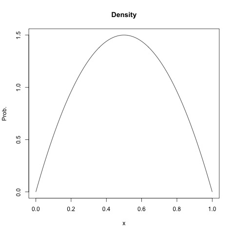

# Chapter 1 : Introduction

### Frequentist 

A standard estimate of population parameter $\theta$ will be the **sample mean**  $\bar y$

Further, to describe the sampling uncertainty of this estimate is to use

**confidence interval (Wald Interval)** 
$$
\bar y  \pm 1.96 \sqrt{\bar y(1-\bar y)/n}
$$
An alternative is proposed as follow:
$$
\hat \theta  \pm 1.96 \sqrt{\hat \theta(1-\hat \theta)/n}
$$
where $\hat \theta = \frac{n}{n+4}\bar y + \frac{4}{n+4} \frac{1}{2}$ 

This method, although it is not originally inspired by Bayesian view, is related to Bayesian inference.

Using $\theta \sim beta(2, 2)$ as weak prior information. ( $E[\theta] = 1/2$ ).

